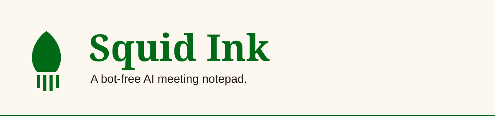

<p align="center"></p>

<p align="center">
  
  
  
  
</p>

**A bot-free AI meeting notepad. It records on your own device, transcribes, and writes a structured note you can question.**

[Live site](https://squid-ink.vercel.app) · press Try the demo

## Status

| Row | |
|---|---|
| Phase | In build. The core chain works end to end. |
| Shipped | Recorder, Gemini transcription, note generation, embeddings, ask-your-notes chat, Dashboard, Personas, Collections, Settings, Onboarding, Auth, Record HUD |
| Next | [#72](https://github.com/tekguyz/squid-ink/issues/72) Record HUD rough notes pane. Order is tracked in [#39](https://github.com/tekguyz/squid-ink/issues/39). |
| Updated | 2026-09-29 |

## What it does

- Records system audio, mic audio, or both, in the browser. No bot joins the call.
- Transcribes with Gemini and labels who spoke.
- Writes a note (summary, takeaways, action items) through a persona. A persona sets the lens and the depth: Brief, Dense or Exhaustive.
- Links each claim in a note back to the transcript line it came from.
- Answers questions about one note, or across all notes.
- Groups notes into collections, by hand or by auto-file rules, with tags.
- Shows a demo with sample data. One button starts it.

## What it never does

- Join your call as a bot.
- Show a real id to the browser. The client sees slugs, never uuids.
- Let one user read another user's rows. Row-level security (RLS, the database's per-user lock) enforces it.
- Put a colour outside `app/globals.css`. Every colour is a token.

## Stack

| Layer | Choice |
|---|---|
| App | Next.js App Router, React Server Components, TypeScript |
| Styling | Tailwind CSS v4, one token file for both themes |
| Data and auth | Supabase (Postgres, Auth, Storage) with RLS |
| Transcription | Google Gemini |
| Notes and chat | Anthropic Claude via the AI SDK |
| Embeddings | Voyage |
| Hosting | Vercel |

## Run it locally

You need Node 24 and a Supabase project.

```bash
npm ci
cp .env.local.example .env.local
npm run dev
```

Fill in `.env.local`:

| Variable | Where it comes from |
|---|---|
| `NEXT_PUBLIC_SUPABASE_URL`, `NEXT_PUBLIC_SUPABASE_PUBLISHABLE_KEY` | Supabase project API keys |
| `SUPABASE_SECRET_KEY` | Supabase project API keys. Server only. Bypasses RLS. |
| `CRON_SECRET` | Any random string of 32+ characters |
| `GEMINI_API_KEY` | Google AI Studio |
| `ANTHROPIC_API_KEY` | Anthropic Console |
| `VOYAGE_API_KEY` | Voyage AI |
| `DEV_LOGIN_PASSWORD` | Leave unset. `/api/dev-login` writes one on first use. |

In development, open `/api/dev-login` to sign in as a test account. Hosted setup, redirect lists and Vercel variables: [`docs/DEPLOYMENT.md`](docs/DEPLOYMENT.md).

## Tests

```bash
npm run test:unit
npm run test:integration
```

Never `npm test`. It stops on purpose. CI runs typecheck, `test:unit` and build on every PR.

## Docs

- [`PRODUCT.md`](PRODUCT.md) and [`DESIGN.md`](DESIGN.md): who it is for, and how it looks
- [`docs/ROADMAP.md`](docs/ROADMAP.md): scope and plan
- [`docs/DECISIONS.md`](docs/DECISIONS.md): what is locked
- [`docs/KNOWN_GAPS.md`](docs/KNOWN_GAPS.md): what is deliberately not built
- [`docs/adr/`](docs/adr): decision records
- [`CLAUDE.md`](CLAUDE.md) and [`CONTEXT.md`](CONTEXT.md): conventions and glossary

---

<p align="center">Built by <a href="https://tekguyz.com">TEKGUYZ</a></p>
